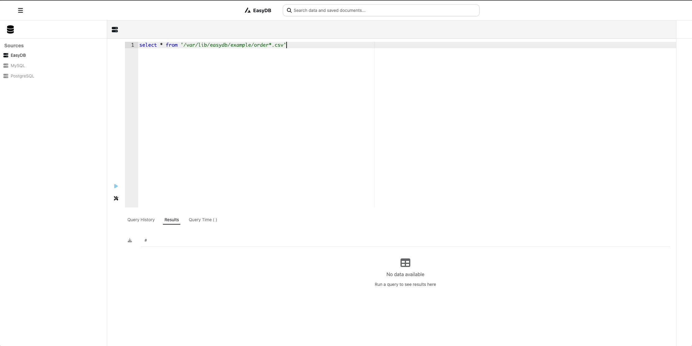

# EasyDB

[](https://hub.docker.com/r/shencangsheng/easydb-backend)

简体中文 | [English](./README.en-us.md)

EasyDB 是一个由 Rust 编写的 SQL 助手，旨在简化文本文件查询过程。通过 EasyDB，你可以将多个文本文件视为一个数据库，并使用 SQL 进行查询。它支持多种文件格式，包括 CSV、NdJson、JSON 和 Parquet 文件，无需进行文件转换，开箱即用。

底层采用了由 Rust 编写的高性能可扩展查询引擎 `DataFusion`。

## 📖 功能

- 支持 CSV 文件
- 支持 NdJson 文件
- 使用标准 SQL 语句对文件数据进行查询

## 🔮 路线

- [ ] 优化异常提示
- [ ] 根据路径自动识别表
- [ ] 自动生成 table schema
- [ ] 支持输出更多数据类型
- [x] 支持 `select * from '/path/example.csv'` 直接访问本地文件，不需要提前 `create table`
- [ ] 支持 s3 远程文件
- [ ] 支持 JSON 文件
- [ ] 支持多路径
- [ ] 支持 MySQL
- [ ] 支持 Parquet 文件

## 🚀 快速开始

```bash
git clone https://github.com/shencangsheng/easy_db.git
docker compose up -d
# http://127.0.0.1:8088
```



### 示例

```sql
select * from '/var/lib/easydb/example/order*.csv'
```

```sql
create table user () location 'example/user.csv'
```

```sql
create table log () location 'example/2025*.log'
```

```sql
select *
from user as t1
inner join log as t2 on (t1.id = t2.user_id)
```

## 👍 依赖库

这些开源库用于创建本项目。

- [apache/datafusion](https://github.com/apache/datafusion)

## 📝 许可证

A short snippet describing the license (MIT)

MIT © Cangsheng Shen